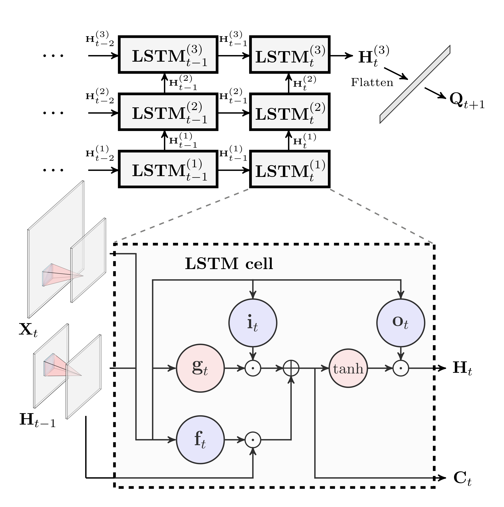

# UEB_ConvLSTM

Source codes for streamflow simulation using integrated UEB and ConvLSTM model.



MxNet, an open-source deep learning software framework, is used to implement and train deep neural networks.

Related research article: **Hybrid physically-based and deep learning modeling of a snow dominated mountainous karst watershed**

Citation:

```
@article{xu2022hybrid,
  title={Hybrid Physically Based and Deep Learning Modeling of a Snow Dominated, Mountainous, Karst Watershed},
  author={Xu, Tianfang and Longyang, Qianqiu and Tyson, Conor and Zeng, Ruijie and Neilson, Bethany T},
  journal={Water Resources Research},
  volume={58},
  number={3},
  pages={e2021WR030993},
  year={2022},
  publisher={Wiley Online Library}
}
```
